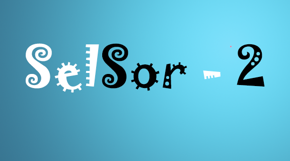
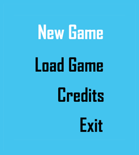
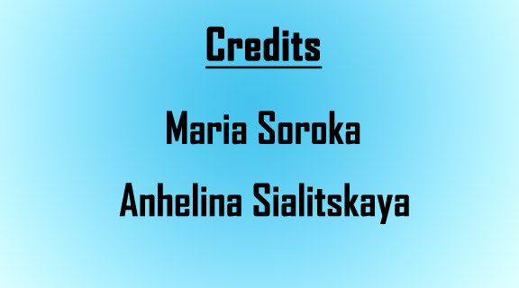
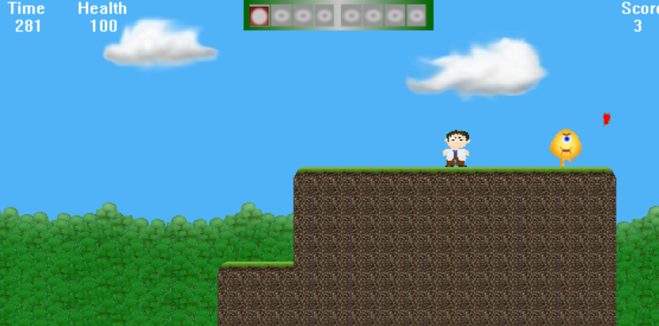

# SelSor-2

SelSor-2 простая 2D игра, написанная на языке C++ с использованием WinAPI.
- Данная игра представлена в виде 4 уровней, в каждом из которых игроку предлагается для завершения уровня дойти до контрольной точки, помеченной крестиком.
- В игре имеется 4 вида врагов, различающиеся по виду и нанесению урона. 
- Также имеется 4 вида гаджетов, которые игрок может использовать нажав клавишу E и перемещаться между гаджетами с помощью Z и X. 
# Начало игры
Чтобы начать игру, нажмите ENTER

После этого появится меню игры

При выборе Credits появится следующее окно:

При выборе # NewGame запускается первый уровень игры

