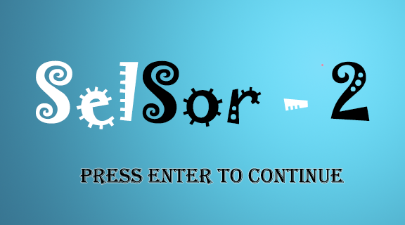
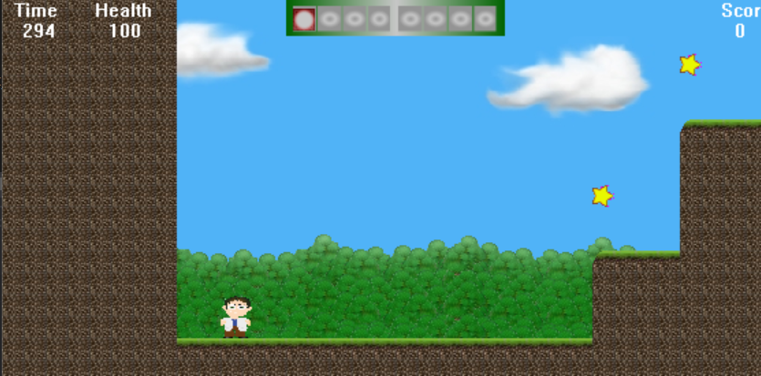
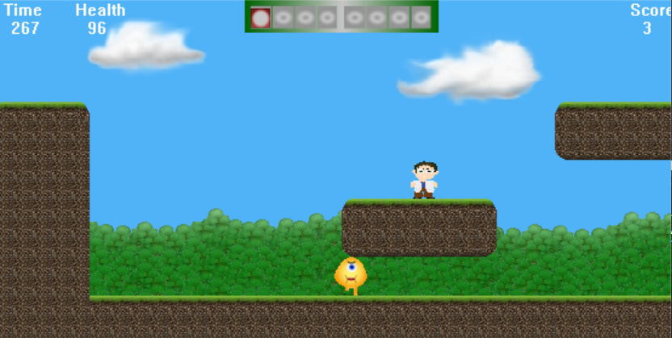
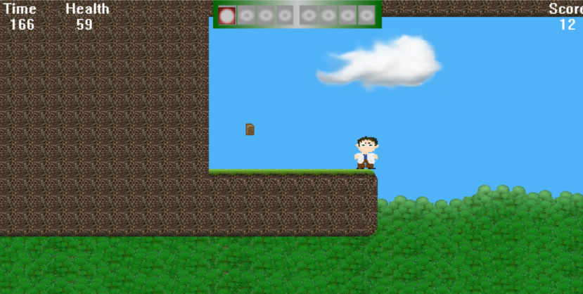
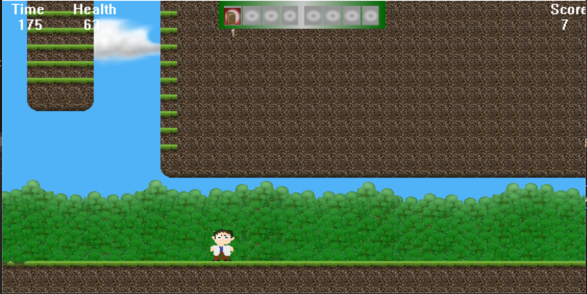
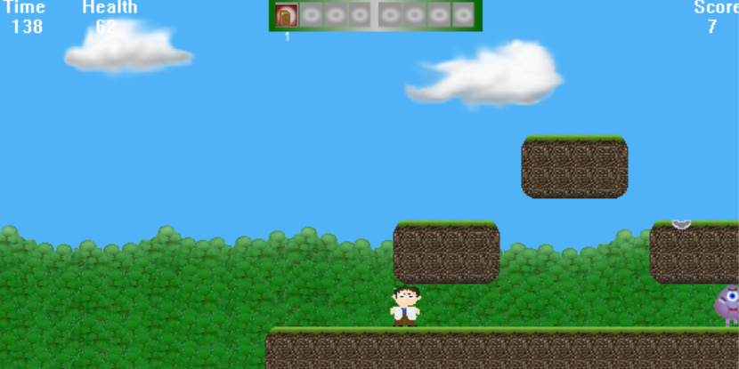
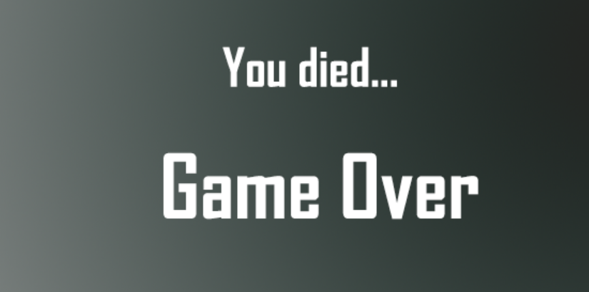
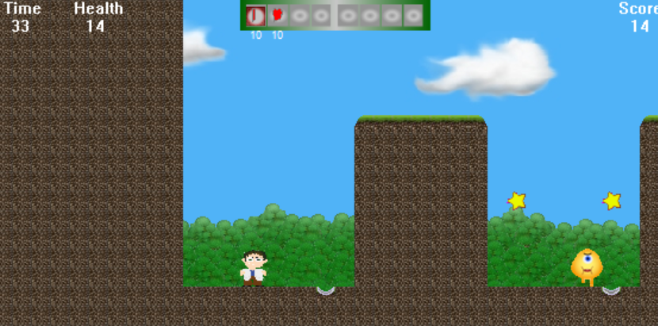
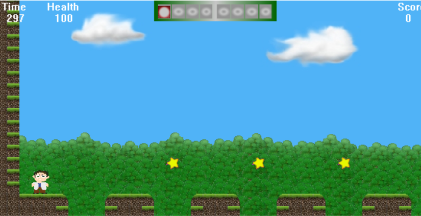
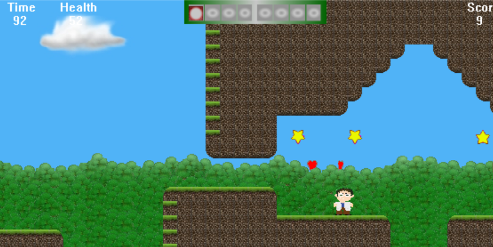

# SelSor-2

SelSor-2 простая 2D игра, написанная на языке C++ с использованием WinAPI.
- Данная игра представлена в виде 4 уровней, в каждом из которых игроку предлагается для завершения уровня дойти до контрольной точки, помеченной крестиком.
- В игре имеется 4 вида врагов, различающиеся по виду и нанесению урона. 
- Также имеется 4 вида гаджетов, которые игрок может использовать нажав клавишу E и перемещаться между гаджетами с помощью Z и X. 
# Гаджеты
- Звездочки(очки)
- Сердечки(для пополнения здоровья игрока)
- Ключи(для открывания дверей)
- Призма(при завершении игры)
# Начало игры
- Чтобы начать игру, нажмите ENTER

- После этого появится меню игры

- При выборе Credits появится следующее окно:

- При выборе Load Game загружается текущий уровень, до которого вы дошли

# Уровень 1
- При выборе NewGame запускается первый уровень игры

- После удачного завершения игры появляется следующее окно

# Уровень 2
- Второй уровень выглядит как показано ниже

# Пройгрыш
- При пройгрыше, который возникает, когда заканчивается здоровье или время, появляется следующее окно

# Уровень 3
- Третий уровень выглядит, как показано ниже 

# Уровень 4
- Четвертый уровень выглядит, как показано ниже 

# Успешное завершение игры

